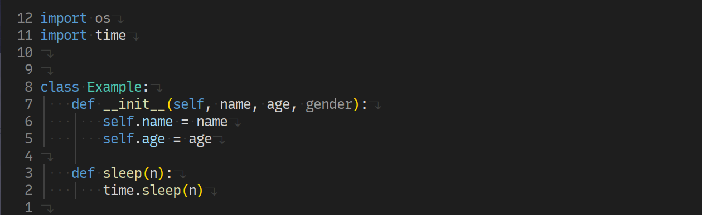

# README

## INTRODUCTION

`lsp_extra_dim` is a `neovim` plugin written 100% in `lua`. Aims to provide dimmed styles for some unused `variables`, `functions`, `parameters` and disable `Lsp Diagnostic Style`


He is inspired by [neodim](https://github.com/zbirenbaum/neodim) and [dim](https://github.com/0oAstro/dim.lua). But with some cool features.

## USE

From lazy.nvim:

```lua
{
    "askfiy/lsp_extra_dim",
    event = { "LspAttach" },
    config = function ()
        require("lsp_extra_dim").setup()
    end
}
```

## CONFIG

The configurations that can be passed in setup are:

```lua
return {
    hooks = {
        -- see: README/CONCEPT
        -- after the default filter function runs, the following hook function will be executed
        lsp_filter = function(diagnostics)
            -- get all used diagnostics
            return diagnostics
        end,
    },

    -- disable diagnostic styling while dimming the colors?
    --------------------------------------
    -- {}    : do not disable any diagnostic styles
    -- "all" : disable all diagnostic styles
    -- { "parameter", "function", "keyword.function"} : only disable diagnostic styles for specific captures
    --------------------------------------
    -- see `https://github.com/nvim-treesitter/nvim-treesitter/blob/master/CONTRIBUTING.md`
    disable_diagnostic_style = "all",
}
```

## CONCEPT

This is a plugin to disable unused extra style in LSP The implementation method is very simple:

- 1. Customize the vim.diagnostic.handlers[signs&#124;virtual_text].show method
- 2. Override the show method of handlers other than underline, Filtering out unused resources
- 3. Underline's show method will still dim them, but other handler's show methods will disable hints such as dummy text

So, he has 1 filtering steps:

- 1. Screening on `lsp diagnostic` level

Filtering at `lsp diagnostic` level will remove all diagnostics containing `unused` (but some diagnostics that qualify in `disable_diagnostic_style` will be kept)

In the configuration of `setup`, `lsp_filter` are the hook functions defined after the default filter function runs.

## CASE

Disable all diagnostic styles:



<details>
  <summary>--snippet--</summary>

```lua
config = function ()
    require("lsp_extra_dim").setup({
        disable_diagnostic_style = "all"
    })
```

</details>

Do not disable any diagnostic styles:


<details>
  <summary>--snippet--</summary>

```lua
config = function ()
    require("lsp_extra_dim").setup({
        disable_diagnostic_style = {}
    })
```

</details>

Disable diagnostic style for function arguments only:


<details>
  <summary>--snippet--</summary>

```lua

config = function ()
    require("lsp_extra_dim").setup({
        disable_diagnostic_style = {
            "parameter"
        }
    })
```

</details>
